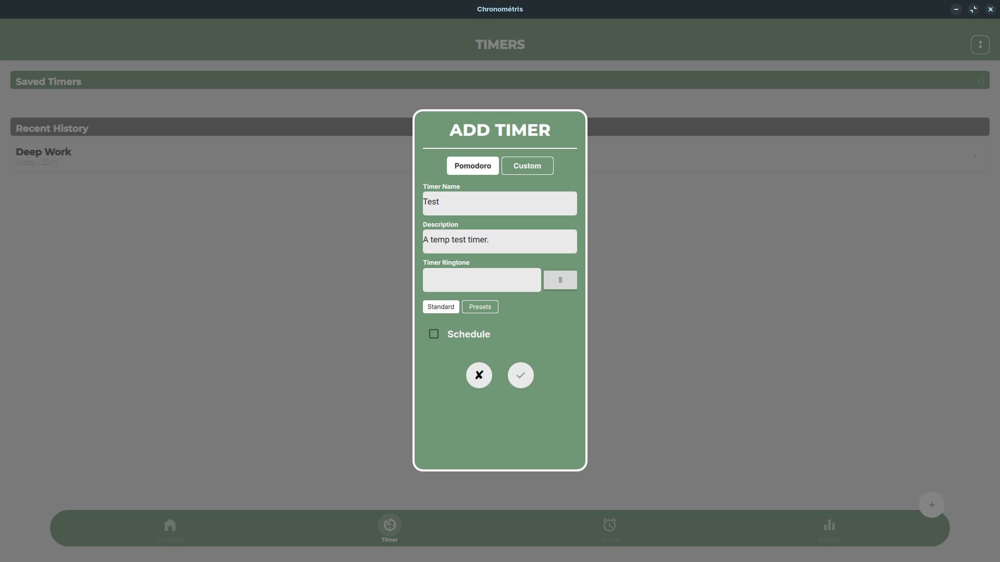

# Chronometris

---

The controlling app for **ChronoFocus** timer. A cross-platform, material themed pomodoro timer app with scheduling and history.

---

### No Timer Running

### Add Timer Popup

### Work Timer Running

---

> Created as a semester project.
> Hardware integration deferred.

> [!WARNING]
> May show unexpected behaviour on devices with patched graphics drivers.
> (🤷 Idk why. I tested it. It doesn't work with patched GPU drivers.)
