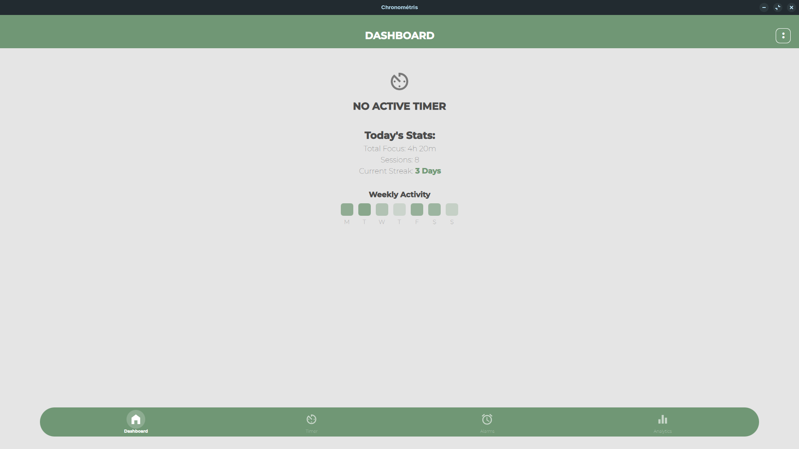
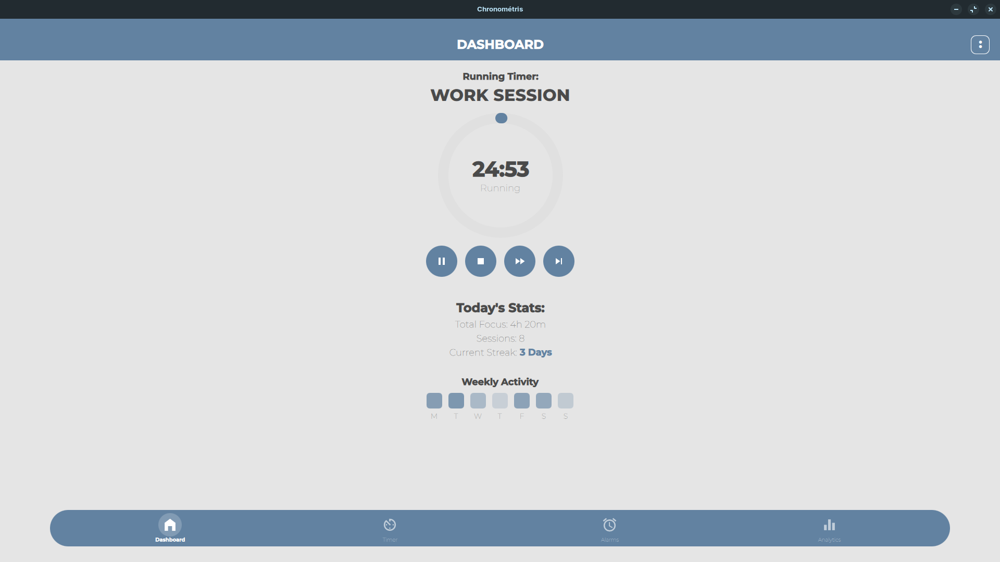

# Chronometris

---

The controlling app for **ChronoFocus** timer. A cross-platform, material themed pomodoro timer app with scheduling and history.

---
## Preview
### No Timer Running


### Add Timer Popup


### Work Timer Running


---

## File Structure
```
Chronometris
├── CMakeLists.txt
├── components
│   ├── ColoredIcon.qml
│   ├── DatePicker.qml
│   ├── RoundButton.qml
│   ├── ThemeManager.qml
│   ├── TimePicker.qml
│   └── TimerProgressCircle.qml
├── main.cpp
├── Main.qml
├── overlays
│   ├── AboutOverlay.qml
│   ├── AddAlarmOverlay.qml
│   ├── AddTimerOverlay.qml
│   └── DetailsOverlay.qml
├── pages
│   ├── AlarmsPage.qml
│   ├── AnalyticsPage.qml
│   ├── DashboardPage.qml
│   └── TimerPage.qml
├── public
│   ├── icons
│   │   ├── account.svg
│   │   ├── add_alarm.svg
│   │   ├── add.svg
│   │   ├── alarm.svg
│   │   ├── analytics.svg
│   │   ├── arrow_drop_down.svg
│   │   ├── check.svg
│   │   ├── close.svg
│   │   ├── dashboard.svg
│   │   ├── delete.svg
│   │   ├── edit.svg
│   │   ├── fast_forward.svg
│   │   ├── fiber_manual_record.svg
│   │   ├── hourglass_bottom.svg
│   │   ├── pause.svg
│   │   ├── play_arrow.svg
│   │   ├── radio_button_checked.svg
│   │   ├── radio_button_unchecked.svg
│   │   ├── settings.svg
│   │   ├── skip_next.svg
│   │   ├── stop.svg
│   │   └── timer.svg
│   ├── images
│   │   ├── 1.webp
│   │   ├── 2.webp
│   │   ├── 3.webp
│   │   ├── 4.webp
│   │   ├── 5.webp
│   │   └── 6.webp
│   └── logo
│       └── Logo.png
├── README.md
└── src
    ├── DatabaseManager.cpp
    ├── DatabaseManager.h
    ├── TimerEngine.cpp
    └── TimerEngine.h

9 directories, 51 files
```

---

> Created as a semester project.
> Hardware integration deferred.

> [!WARNING]
> May show unexpected behaviour on devices with patched graphics drivers.
> (🤷 Idk why. I tested it. It doesn't work with patched GPU drivers.)
